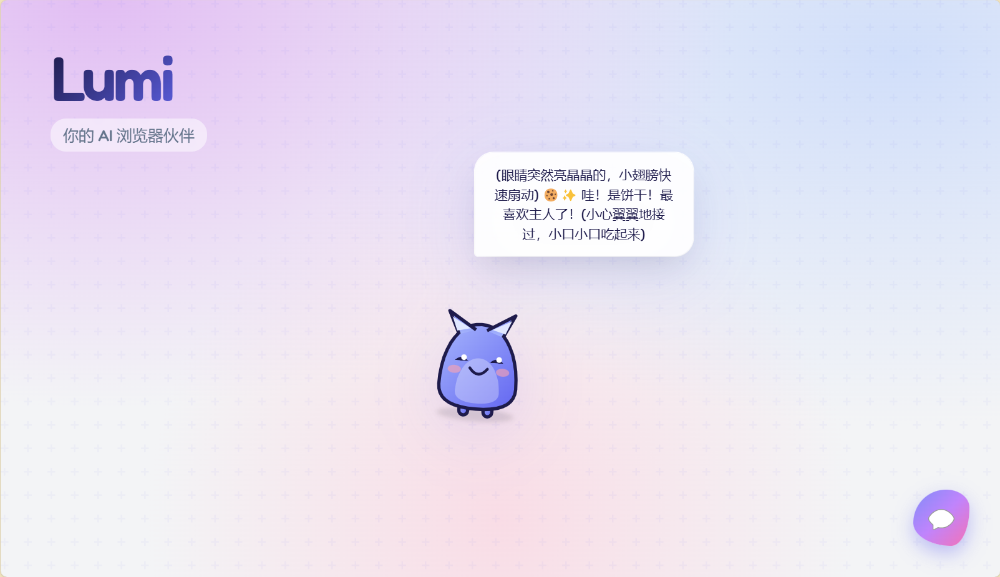
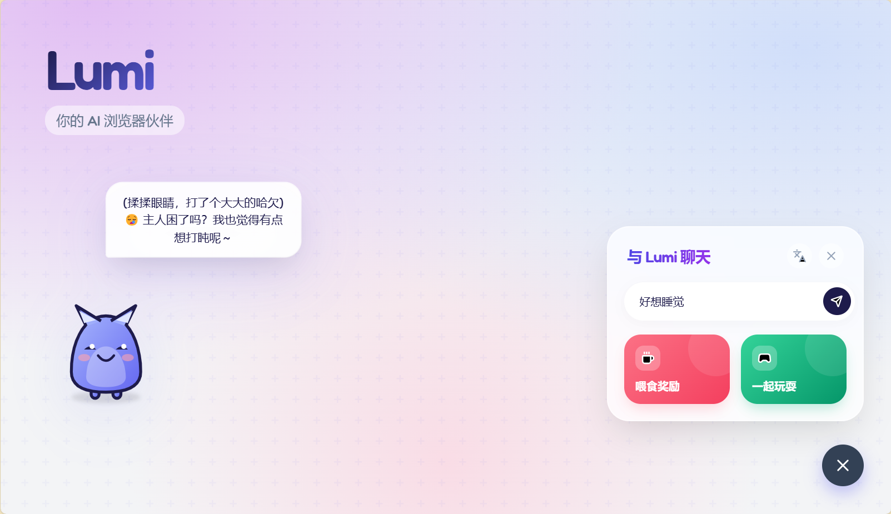

# Lumi - 您的 AI 桌面萌宠 🐱

Lumi 是一个生活在浏览器中的可爱互动虚拟宠物。它基于 **DeepSeek API**，能够与您聊天、在屏幕上漫步，并对您的触摸做出反应。








## ✨ 特性

- **AI 智能交互**：使用 DeepSeek-V3 模型进行流畅、有趣的对话。
- **互动性强**：支持拖拽、点击互动、喂食和玩耍。
- **生动形象**：拥有眨眼、睡觉、思考等多种表情和动作动画。
- **多语言支持**：支持中文（简体）和英文无缝切换。
- **跨平台**：支持桌面浏览器和 Android 设备（作为 PWA 应用安装）。
- **外部样式**：使用独立 CSS 文件，无需依赖 CDN，支持离线或内网环境部署。

## 🚀 本地部署指南

要在您的本地机器上运行 Lumi：

1.  **准备工作**：确保您已安装 `node` 和 `npm`（推荐使用 Vite 环境开发，或者直接使用静态服务器）。

2.  **获取 API Key**：
    *   访问 [DeepSeek 开放平台](https://platform.deepseek.com/)。
    *   创建一个 API Key。

3.  **使用 Vite 运行（推荐）**：
    *   创建一个 React TypeScript 项目：`npm create vite@latest lumi -- --template react-ts`
    *   将本项目中的 `.tsx`, `.ts`, `.css` 文件复制到 `src/` 目录。
    *   将 `index.html` 移动到根目录。
    *   在根目录创建 `.env` 文件：
        ```
        VITE_API_KEY=your_deepseek_api_key_here
        ```
    *   修改 `api.ts`，使用 `import.meta.env.VITE_API_KEY` 替换 `process.env.API_KEY`。
    *   运行 `npm install` 然后 `npm run dev`。

    *或者，快速测试（无需构建工具）：*
    如果您保持现有的 ES module 结构（如 `index.html` 中配置的那样）：
    1.  安装简易服务器：`npm install -g http-server`
    2.  在您的系统环境变量中设置 API Key，或暂时在代码中 `api.ts` 顶部手动填入（注意安全，不要提交到仓库）。
    3.  运行 `http-server .`

## 📱 安卓端部署 (PWA)

Lumi 设计为渐进式 Web 应用 (PWA)，无需打包成 APK 即可在安卓手机上获得原生体验。

1.  **部署**：将代码部署到 Vercel, Netlify 或 GitHub Pages 等支持 HTTPS 的平台。
2.  **访问**：使用安卓手机的 **Chrome 浏览器** 打开部署后的链接。
3.  **安装**：
    *   点击浏览器右上角菜单（三个点）。
    *   选择 **“添加到主屏幕”** 或 **“安装应用”**。
4.  **运行**：Lumi 现已作为独立应用出现在您的桌面上，启动后全屏运行，无浏览器地址栏。

## 🎨 自定义

- **样式**：所有样式均位于 `styles.css`，您可以轻松修改配色或宠物大小。
- **角色**：修改 `components/PetCharacter.tsx` 中的 SVG 路径即可创造您自己的宠物形象。

---
*Powered by DeepSeek*