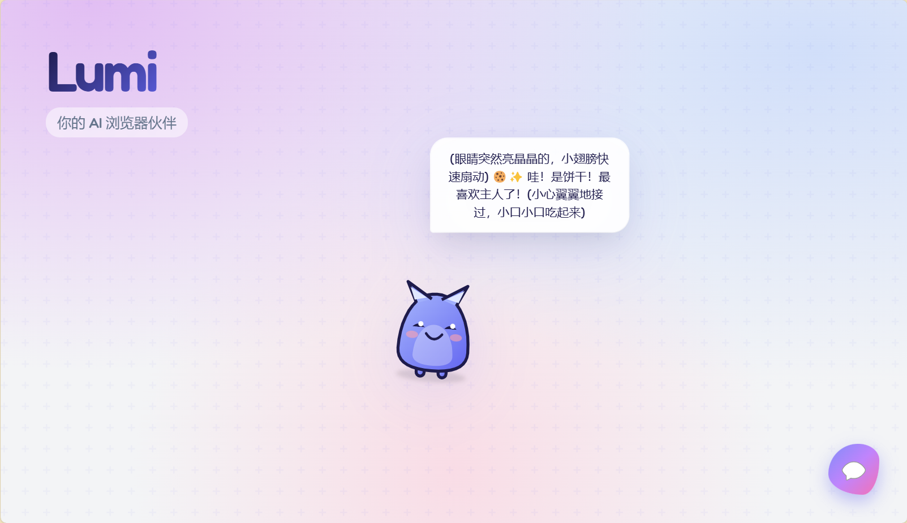
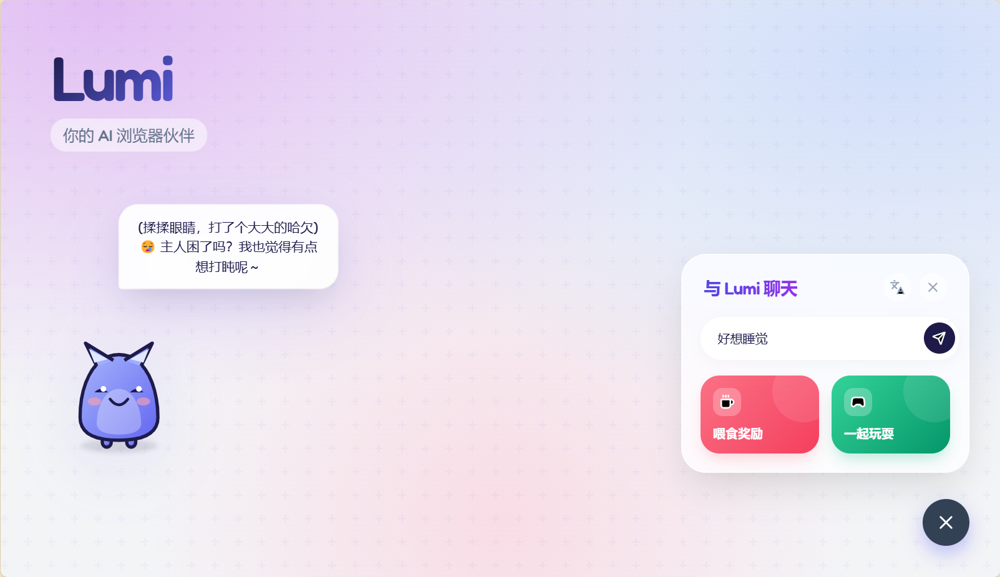

# Lumi - 您的 AI 桌面萌宠 🐱

Lumi 是一只**真正生活在桌面上**的 AI 互动宠物：透明置顶的小猫飘在你的壁纸和窗口之上，不挡操作、常驻托盘。它会观察你的行为 —— 你在打字时默默加油，你离开时打瞌睡，你回来时扑上来欢迎，深夜还会催你睡觉。

基于 React + TypeScript + Electron + framer-motion，支持 **GPT 兼容 API**（OpenAI 格式中转均可）与 **DeepSeek** 双供应商，密钥保存在本地、由主进程调用。





## ✨ 特性

### 🖥️ 真桌面陪伴（Electron）
- **透明置顶窗口**：宠物悬浮在所有窗口之上，背景完全透明，只有宠物本体和面板可以点击，其余区域鼠标穿透，完全不干扰你的工作。
- **系统托盘常驻**：关闭窗口不退出，托盘菜单支持 显示/隐藏、开机自启、退出。
- **单实例锁**：重复启动自动唤起已有宠物。

### 🧠 行为感知互动
- **系统级空闲检测**（`powerMonitor`）：45 秒无操作开始打盹，4 分钟进入深睡；你一回来就根据离开时长说"欢迎回来"。
- **键鼠感知**：检测到高频打字 → 给你加油打气；鼠标飞快移动 → 看得头晕目眩 💫。
- **场景反应**：拖拽它、单击摸头（❤️ 亲密度涨）、双击跳跳、喂食、陪玩，各有专属动作和台词。
- **养成系统**：饱食度 / 心情 / 精力三项状态随时间衰减（睡觉时恢复）， affection 亲密度升级（羁绊等级），左下角状态卡实时可见。
- **时段感知**：早安 / 午安 / 晚安问候；深夜 23 点后主动催你睡觉 🌙。
- **系统事件**：电脑休眠唤醒、锁屏解锁，Lumi 都会有反应。

### 🤖 AI 对话（双供应商）
- **GPT 兼容接口**：任意 OpenAI 格式 API（含中转站），在 `config.json` 里填 `baseURL + apiKey + model` 即可。
- **DeepSeek**：填入 key 即用。
- **设置面板随时切换**大脑，支持"AI 主动搭话"开关（控制它多久自言自语一次）。
- **主进程代理调用**：API Key 永不进入渲染进程，无 CORS 问题。
- **故障转移**：当前供应商失败时自动尝试下一个已配置的供应商。
- **离线降级**：没配 Key 也能跑 —— 本地萌语短语池让它继续陪伴你。

### 🎨 形象与动画
- 圆滚滚小猫：摇摆尾巴、呆毛、耳朵抖动、ω 嘴、腮红、胡须、大眼睛高光与自然眨眼。
- 10 种状态动画：待机呼吸、走路弹跳、睡觉 Zzz、思考、吃饭（小饼干）、玩耍、欢呼、眩晕、聊天、被拖拽。
- 粒子特效：摸头冒爱心、开心冒星星、打盹冒 Zzz、哼歌冒音符 ♪。

## 🚀 快速开始

### 方式一：开发运行（推荐）
```bash
npm install
npm run electron:dev   # 启动桌宠（Vite 热更新 + Electron）
```

### 方式二：正式运行
```bash
npm run electron:start # 构建 dist 并以 Electron 启动
```

### 方式三：打包成 exe（免安装绿色版）
```bash
npm run dist           # 产物在 release/Lumi-x.x.x-portable.exe
```
> 国内网络如下载超时，请带上 npmmirror 镜像：
> ```bash
> ELECTRON_MIRROR=https://npmmirror.com/mirrors/electron/ \
> ELECTRON_BUILDER_BINARIES_MIRROR=https://npmmirror.com/mirrors/electron-builder-binaries/ \
> npx electron-builder --win portable
> ```

### 方式四：纯网页模式（浏览器 / PWA）
```bash
npm run dev            # 浏览器打开 http://localhost:3000
```
网页模式下同样可以陪伴你（含键鼠感知与 AI 对话），但没有系统空闲检测和托盘。

## ⚙️ 配置 AI

编辑 `public/config/config.json`（该文件已在 .gitignore 中，不会泄露密钥）：

```json
{
  "activeProvider": "gpt",
  "providers": {
    "gpt": {
      "name": "GPT (OpenAI 兼容)",
      "baseURL": "https://api.example.com/v1",
      "apiKey": "sk-xxxxxxxx",
      "model": "gpt-5.5"
    },
    "deepseek": {
      "name": "DeepSeek",
      "baseURL": "https://api.deepseek.com/v1",
      "apiKey": "sk-xxxxxxxx",
      "model": "deepseek-chat"
    }
  },
  "ai": {
    "idleThoughts": true,
    "minAIIntervalMinutes": 10
  }
}
```

- `activeProvider`：默认使用的大脑，也可以在应用内设置面板（💬 → ⚙️）里随时切换。
- `idleThoughts`：是否允许 Lumi 用 AI 自言自语；`minAIIntervalMinutes` 限制主动调用的最小间隔，省 token。
- 修改配置后重启应用生效。
- 应用内设置（语言、供应商选择、AI 搭话开关）保存在 localStorage，即时生效。

## 📁 项目结构

```
├── electron/
│   ├── main.cjs        # 主进程：透明窗口、托盘、AI 代理、空闲检测
│   └── preload.cjs     # contextBridge 安全桥
├── components/
│   ├── Pet.tsx         # 宠物容器：漫步、拖拽、动作状态机
│   ├── PetCharacter.tsx# SVG 形象与全部动画/粒子
│   ├── ChatBubble.tsx  # 对话气泡
│   ├── Controls.tsx    # 聊天面板 + 喂食/玩耍
│   ├── SettingsPanel.tsx # 供应商/语言/AI 开关设置
│   └── StatsBar.tsx    # 饱食/心情/精力/羁绊状态卡
├── behavior.ts         # 行为引擎：状态衰减、空闲、键鼠感知、反应
├── ai.ts               # AI 服务层：供应商抽象、提示词、短语池
├── scripts/gen-icon.cjs# 零依赖生成应用图标
├── assets/icon.png     # 托盘/窗口图标
└── public/config/      # config.json（你的密钥，已 gitignore）
```

## 🎮 交互一览

| 操作 | 反应 |
|------|------|
| 单击宠物 | 摸头：爱心 + 亲密度上涨 |
| 双击宠物 | 跳高高 + 惊喜台词 |
| 拖拽 | 惊呼 + 失重表情，放到哪住到哪 |
| 右下 💬 | 打开聊天面板 / 喂食 / 玩耍 / 设置 |
| 打字很勤 | 偶尔为你加油 ⚡ |
| 45 秒不动 | 打盹 💤 |
| 深夜还在 | 催你睡觉 🌙 |

## 📱 安卓端（PWA）

部署到任意 HTTPS 静态托管后，用 Chrome 打开 → "添加到主屏幕"即可作为独立 App 全屏运行（网页模式能力）。

---
*Powered by GPT / DeepSeek · Made with 💜*
